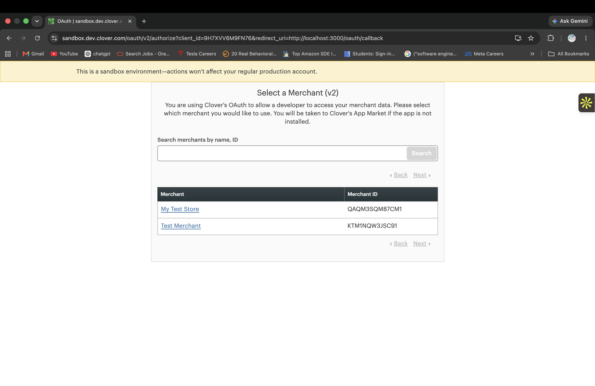

# Clover Payment Integration

A full-stack web application that integrates with the Clover REST API to process payments. Built with Node.js/Express backend and HTML/CSS/JavaScript frontend.

**Stack:** Node.js · Express · Vanilla JavaScript · Clover REST API · OAuth2

---

## Features

- Full OAuth2 authorization code flow
- Create orders and add line items via Clover API
- Process payments and fetch real-time status
- Transaction logging — every payment saved locally
- Clean step-by-step payment UI
- Graceful error handling — invalid input, expired tokens, API failures
- Transaction history endpoint
- Postman collection for all endpoints

---

## Screenshots

**Payment Form**


**OAuth Merchant Selection**



**Payment Form Filled**


**Payment Successful**


---

## Requirements Coverage

| Requirement | Status |
|-------------|--------|
| OAuth2 authentication | ✅ |
| Secure token storage | ✅ |
| Create order | ✅ |
| Add line item | ✅ |
| Process payment | ✅ |
| Display payment status | ✅ |
| Log transactions locally | ✅ |
| Frontend UI *(optional — implemented)* | ✅ |
| Error handling — failed requests | ✅ |
| Error handling — expired tokens | ✅ |
| Postman collection | ✅ |

---

## Getting Started

### Prerequisites

- Node.js v18+
- Clover sandbox account ([create one](https://www.clover.com/global-developer-home/public/create-account))
- Postman

> **For evaluators:** Sandbox credentials are provided in the submission email — no Clover account needed.

### 1. Clone and install

```bash
git clone https://github.com/ArundhatiCat/clover-payment-integration.git
cd clover-payment-integration/backend
npm install
```

### 2. Configure environment

```bash
cp .env.example .env
```

```env
CLOVER_BASE_URL=https://sandbox.dev.clover.com
CLOVER_MERCHANT_ID=your_merchant_id
CLOVER_CLIENT_ID=your_client_id
CLOVER_CLIENT_SECRET=your_client_secret
PORT=3000
```

### 3. Clover sandbox setup

In the [Clover Developer Dashboard](https://www.clover.com/global-developer-home):

1. Create a new **Web** app
2. Site URL → `http://localhost:3000`
3. Alternate Launch Path → `/oauth/callback`
4. Permissions → Payments (R/W), Orders (W), Inventory (W), Merchant (R)
5. Create a test merchant and install the app

### 4. Run

```bash
npm start
```

Open `http://localhost:3000`

---

## API Endpoints

| Method | Endpoint | Description |
|--------|----------|-------------|
| GET | `/auth` | Initiates OAuth2 flow |
| GET | `/oauth/callback` | Exchanges auth code for token |
| GET | `/api/auth-status` | Returns authentication status |
| POST | `/api/pay` | Processes a payment |
| GET | `/api/transactions` | Returns transaction history |

### POST /api/pay

**Request:**
```json
{
  "amount": 10.00,
  "description": "Test Product"
}
```

**Response:**
```json
{
  "success": true,
  "orderId": "JJ677Z59K139Y",
  "paymentId": "ZMFG1D73340AP",
  "amount": 10,
  "description": "Test Product",
  "result": "SUCCESS"
}
```

---

## Error Handling

| Scenario | Status | Message |
|----------|--------|---------|
| Amount missing or zero | 400 | Invalid amount |
| Description empty | 400 | Description is required |
| Not authenticated | 401 | Please login with Clover first |
| Token expired | 401 | Session expired. Please login again |
| Clover API error | 500 | Error details from Clover |

---

## Testing with Postman

Import `postman/Clover_Payment_Integration.postman_collection.json`

**Test sequence:**
1. `GET /api/auth-status` → `{ "authenticated": false }`
2. Complete OAuth at `http://localhost:3000`
3. `GET /api/auth-status` → `{ "authenticated": true }`
4. `POST /api/pay` → `{ "result": "SUCCESS" }`
5. `GET /api/transactions` → full transaction history

---

## Running Tests

```bash
npm test
```

```
✓ Amount validation — all cases pass
✓ Description validation — all cases pass
✓ Amount to cents conversion — all cases pass
✓ Authentication check — all cases pass

✅ All tests passed successfully
```

---

## Project Structure

```
clover-payment-integration/
├── backend/
│   ├── server.js         # Routes and payment orchestration
│   ├── cloverClient.js   # All Clover API calls
│   ├── test.js           # Validation tests
│   ├── .env.example      # Environment variable template
│   └── package.json
├── frontend/
│   ├── index.html        # Payment UI
│   ├── style.css
│   └── app.js
├── postman/
│   └── Clover_Payment_Integration.postman_collection.json
├── screenshots/
├── ARCHITECTURE.md       # Technical design, decisions, production roadmap
└── README.md
```

---

## Further Reading

See [ARCHITECTURE.md](./ARCHITECTURE.md) for system design, OAuth2 flow, technology decisions, security architecture, and production roadmap.

---

## License

MIT — Arundhati Rajendra