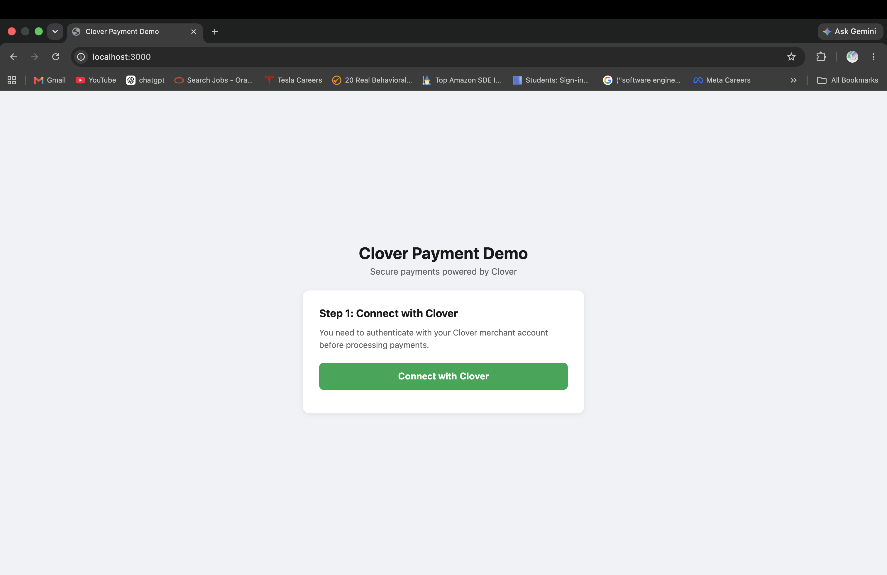
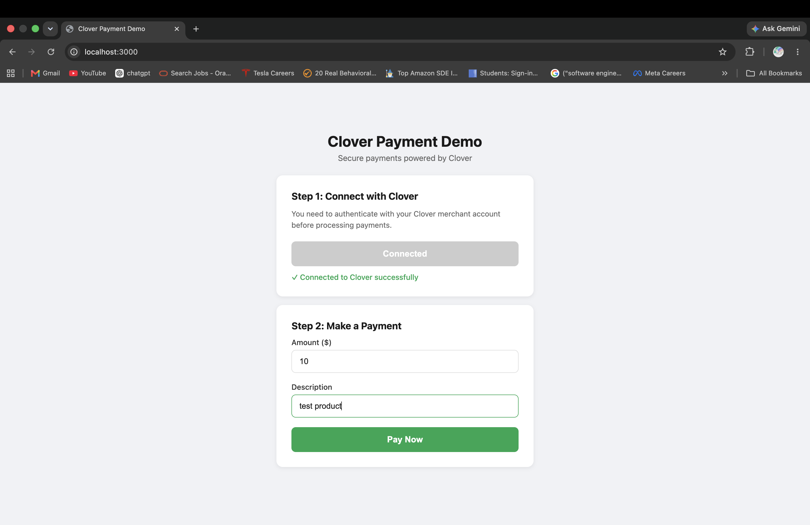
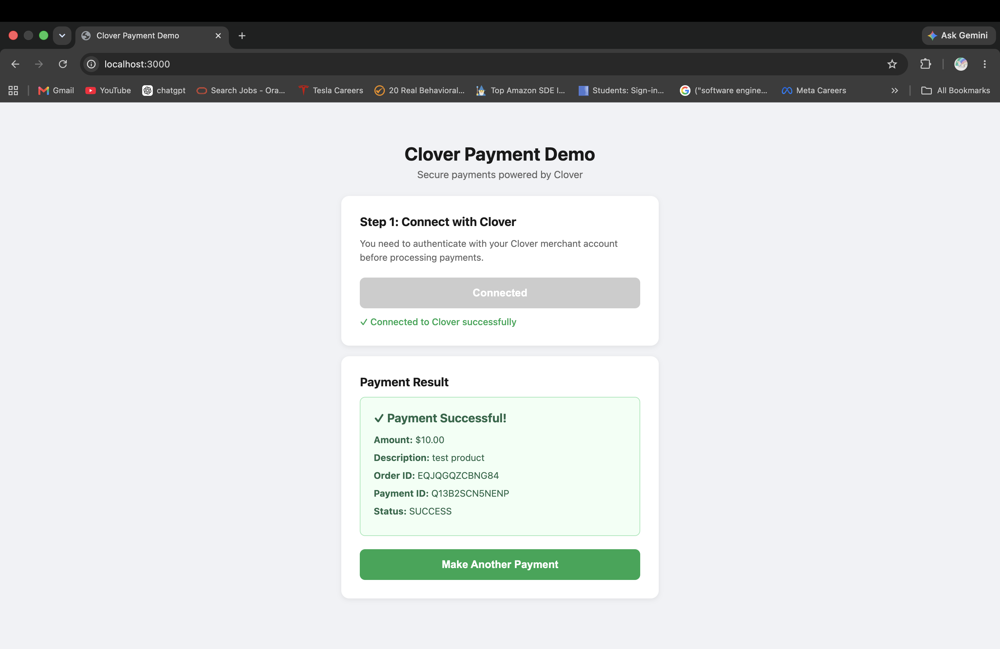

# Clover Payment Integration

> A full-stack payment application built on the Clover REST API — featuring complete OAuth2 authentication, order management, and real-time payment processing.

Built as part of a Full Stack AI Engineer Intern technical assessment. Every requirement from the spec is implemented, including the optional frontend UI.

---

## It Works — See For Yourself

| Step 1: Connect | Step 2: Pay | Step 3: Success |
|----------------|-------------|-----------------|
|  |  |  |

---

## What This App Does

A merchant opens the app, authenticates via Clover OAuth2, enters an amount and product description, and processes a real sandbox payment — all in under 30 seconds.

Under the hood:
- Full OAuth2 authorization code flow (not API key shortcuts)
- Creates a Clover order, adds a line item, processes payment, fetches status
- Logs every transaction locally with timestamp and payment ID
- Handles all error cases — expired tokens, invalid input, API failures

---

## Architecture


### How OAuth2 Works in This App


---

## Tech Stack & Why

| Layer | Choice | Why This Over Alternatives |
|-------|--------|---------------------------|
| Backend | Node.js + Express | Best fit for I/O-bound API proxying. Non-blocking, fast setup, native JSON |
| Frontend | HTML + CSS + Vanilla JS | Assignment specifies "basic JS". No build tools = evaluator runs it instantly |
| HTTP Client | Axios | Throws on 4xx/5xx unlike fetch. Cleaner headers. Future interceptor support |
| Auth | OAuth2 v2 (full flow) | Implements the spec properly. Code → token exchange on backend keeps secrets safe |
| Config | dotenv | Industry standard. `.env.example` documents all required variables |
| Logging | fs.appendFileSync | Zero dependencies. Meets "log transaction details locally" requirement directly |

---

## Project Structure

```
clover-payment-integration/
├── backend/
│   ├── server.js           # Express server — routes, OAuth, payment orchestration
│   ├── cloverClient.js     # Clover API layer — all 5 API calls isolated here
│   ├── package.json
│   └── .env.example        # Required environment variables (template)
├── frontend/
│   ├── index.html          # Single-page payment UI
│   ├── style.css           # Clean, responsive styling
│   └── app.js              # OAuth redirect handling + payment fetch logic
├── postman/
│   └── Clover_Payment_Integration.postman_collection.json
├── screenshots/
├── ARCHITECTURE.md         # Deep dive: decisions, tradeoffs, production path
└── README.md
```

**Key design decision:** All Clover API calls live in `cloverClient.js`, not scattered in `server.js`. This separation means the API layer can be tested, mocked, or swapped independently.

---

## Quick Start

### Prerequisites
- Node.js v18+
- Clover sandbox account ([create one here](https://www.clover.com/global-developer-home/public/create-account))
- Postman

### 1. Clone and install

```bash
git clone https://github.com/ArundhatiCat/clover-payment-integration.git
cd clover-payment-integration/backend
npm install
```

### 2. Configure environment

```bash
cp .env.example .env
```

Fill in your Clover sandbox credentials:

```env
CLOVER_BASE_URL=https://sandbox.dev.clover.com
CLOVER_MERCHANT_ID=your_merchant_id
CLOVER_CLIENT_ID=your_client_id
CLOVER_CLIENT_SECRET=your_client_secret
PORT=3000
```

### 3. Set up Clover sandbox app

In the [Clover Developer Dashboard](https://www.clover.com/global-developer-home):

- Create a new **Web** app
- Site URL → `http://localhost:3000`
- Alternate Launch Path → `/oauth/callback`
- Permissions → Payments (R/W), Orders (W), Inventory (W), Merchant (R)
- Create a test merchant and install the app on it

### 4. Run

```bash
node server.js
# Server running on http://localhost:3000
```

---

## Payment Flow

Every payment goes through 5 Clover API calls in sequence:

```
POST /v3/merchants/{mId}/orders
  → Create the order container

POST /v3/merchants/{mId}/orders/{orderId}/line_items
  → Add what was purchased (name + price in cents)

GET  /v3/merchants/{mId}/tenders
  → Fetch available payment methods dynamically

POST /v3/merchants/{mId}/orders/{orderId}/payments
  → Process the payment using external tender (sandbox)

GET  /v3/merchants/{mId}/payments/{paymentId}
  → Fetch final payment status
```

---

## API Reference

| Method | Endpoint | Description | Body |
|--------|----------|-------------|------|
| GET | `/auth` | Start OAuth2 flow | — |
| GET | `/oauth/callback` | Handle Clover redirect, store token | — |
| GET | `/api/auth-status` | Check if authenticated | — |
| POST | `/api/pay` | Process a payment | `{ amount, description }` |

**Example:**

```bash
curl -X POST http://localhost:3000/api/pay \
  -H "Content-Type: application/json" \
  -d '{"amount": 10.00, "description": "Test Product"}'
```

**Response:**

```json
{
  "success": true,
  "orderId": "JJ677Z59K139Y",
  "paymentId": "ZMFG1D73340AP",
  "amount": 10,
  "description": "Test Product",
  "result": "SUCCESS"
}
```

---

## Error Handling

| Scenario | Status | Message |
|----------|--------|---------|
| Amount missing or zero | 400 | Invalid amount |
| Description empty | 400 | Description is required |
| Not authenticated | 401 | Not authenticated. Please login |
| Token expired | 401 | Session expired. Please login again |
| Clover API failure | 500 | Error details from Clover |

Token expiry clears the stored token automatically and prompts re-authentication.

---

## Transaction Logging

Every successful or failed payment attempt is appended to `backend/transactions.log`:

```
2026-06-13T02:34:21.000Z - {"orderId":"JJ677Z59K139Y","paymentId":"ZMFG1D73340AP","amount":1000,"description":"Test Product","result":"SUCCESS","timestamp":"2026-06-13T02:34:21.000Z"}
```

---

## Testing with Postman

Import `postman/Clover_Payment_Integration.postman_collection.json`.

**Test order:**
1. Run **Check Auth Status** → should return `{ "authenticated": false }`
2. Open browser → `http://localhost:3000` → Connect with Clover → complete OAuth
3. Run **Check Auth Status** again → should return `{ "authenticated": true }`
4. Run **Process Payment** → should return `{ "success": true, "result": "SUCCESS" }`

---

## If I Had More Time

- **Refresh token support** — auto-renew expired tokens without user re-login
- **Persistent token storage** — survive server restarts using encrypted DB storage
- **Transaction history page** — query and display past payments from the log
- **Webhook receiver** — accept real-time payment events from Clover
- **Rate limiting** — protect the `/api/pay` endpoint from abuse
- **Unit tests** — test `cloverClient.js` functions with mocked Axios responses

---

## License

MIT